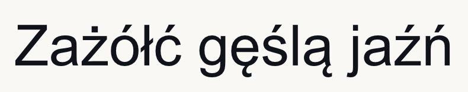
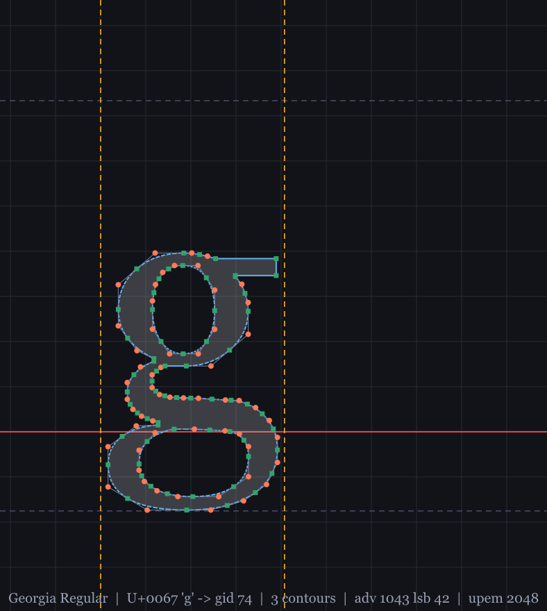
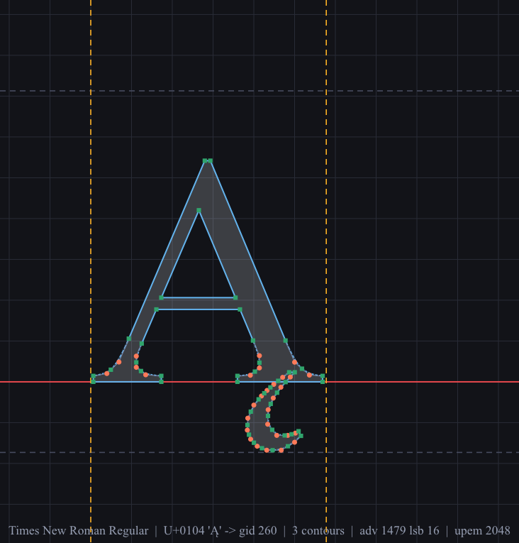
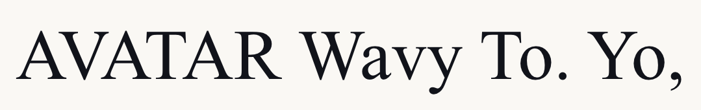
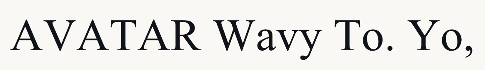

# Kroj

Silnik fontów TrueType napisany od zera na czystej bibliotece standardowej Pythona.
Jeden plik, ~1650 linii, **zero zależności** — bez PIL, bez freetype, bez fontTools.

Parsuje `.ttf` / `.ttc`, rozwiązuje kontury (łącznie z glifami złożonymi), mapuje znaki
przez `cmap`, stosuje kerning z `kern` **albo** z GPOS, spłaszcza krzywe Béziera,
rasteryzuje z antyaliasingiem i zapisuje PNG własnoręcznie (`zlib` + `struct`).



## Po co

Bo cała ścieżka „plik binarny → piksele na ekranie" jest zwykle schowana za jednym
`import`. Tutaj nie ma nic schowanego: tabela sfnt, `loca`, `glyf`, punkty on/off-curve,
reguła nonzero winding, deflate w PNG — wszystko widać.

## Użycie

```bash
python kroj.py selftest
```

```bash
python kroj.py text --font arial.ttf --text "Zażółć gęślą jaźń" --size 96 --out out.png
```

```bash
python kroj.py glyph --font georgia.ttf --char g --size 520 --out glif.png
```

```bash
python kroj.py info --font times.ttf --kern-pairs
```

```bash
python kroj.py term --font impact.ttf --text KROJ --cols 92
```

`--font` przyjmuje ścieżkę, samą nazwę pliku (`arial.ttf`) albo fragment nazwy rodziny
(`georgia`) — reszta to przeszukanie katalogów systemowych. Bez `--font` bierze pierwszy
sensowny font, jaki znajdzie.

### Komendy

| komenda | co robi |
|---|---|
| `text` | składa napis do PNG; opcjonalnie eksportuje te same kontury do SVG (`--svg`) |
| `glyph` | diagram pojedynczego glifu: siatka, metryki, punkty kontrolne |
| `info` | metadane, tabele, pokrycie cmap, źródło kerningu |
| `term` | ASCII-art prosto z konturów |
| `selftest` | 43 asercje na syntetycznym foncie budowanym w pamięci |

Przydatne flagi `text`: `--color`, `--bg` (nazwa albo `#rrggbb[aa]`), `--align`,
`--tracking`, `--line-height`, `--tight` (przycięcie do tuszu), `--no-kerning`,
`--samples` (jakość antyaliasingu w pionie), `\n` w tekście robi nową linię.

## Inspektor glifów

`kroj.py glyph` rysuje glif razem z tym, czego normalnie nie widać: siatką co 1/8 em,
linią bazową (czerwona), szerokością awansu (bursztynowa), pasem ascender/descender,
uchwytami kontrolnymi oraz punktami — **zielone kwadraty to punkty on-curve, pomarańczowe
kółka to punkty kontrolne**. Podpis pod spodem jest złożony tym samym krojem, który
właśnie oglądasz.



Po lewej widać, jak działa glif złożony: `Ą` w Times New Roman to nie jeden kontur, tylko
odwołanie do `A` (kontur zewnętrzny + licznik) plus ogonek doklejony transformacją.



## Kerning

Kerning jest realny, nie udawany. Ten sam napis w Times New Roman:

| | szerokość |
|---|---|
|  | 1079 px |
|  | 1164 px |

85 px różnicy na 19 glifach. Pary czytane są z tabeli `kern` (format 0), a jeśli jej nie
ma — z GPOS: lookup typu 2 (pair adjustment) w obu formatach, plus typ 9 (extension),
z tablicami coverage i class definition. Sporo współczesnych krojów w ogóle nie ma już
`kern` i bez GPOS wyglądałyby luźno.

## Jak to działa

**Parsowanie.** `Reader` to kursor big-endian po `bytes`. Katalog tabel sfnt → `head`
(unitsPerEm, format `loca`), `maxp` (liczba glifów), `hhea`/`hmtx` (awanse, lsb),
`loca` (offsety), `glyf` (kontury), `cmap` (formaty 0, 4, 6, 12), `name`, `kern`, `GPOS`.

**Kontury.** TrueType trzyma punkty jako ciąg on-curve / off-curve. Dwa kolejne punkty
kontrolne implikują punkt on-curve dokładnie w połowie między nimi; kontur może się też
zaczynać od punktu kontrolnego. `_decode_contour` sprowadza to do jawnych komend
`m` / `l` / `q`. Glify złożone rekurencyjnie wciągają komponenty i nakładają macierz
2×2 z offsetem (skala, pochylenie, odbicie).

**Spłaszczanie.** Dla kwadratowej Béziera maksymalne odchylenie od cięciwy wynosi
`|p0 - 2·p1 + p2| / 8`, a podział na *n* odcinków dzieli je przez *n²*. Stąd liczba
odcinków wyliczana jest tak, żeby błąd zszedł poniżej 0,12 piksela — małe glify dostają
mało punktów, duże dużo.

**Rasteryzacja.** Skanlinia z regułą nonzero winding. W poziomie pokrycie jest
**analityczne** (dokładny ułamek piksela na końcach span-u), w pionie
**nadpróbkowane** (domyślnie 15 podlinii na wiersz). Krawędzie wchodzą do listy aktywnej
w kolejności rosnącego *y*, więc jeden przebieg w przód wystarcza. Liczniki (dziury w
literach) wychodzą same z siebie, bo mają przeciwny kierunek nawijania.

**PNG.** `IHDR` + `IDAT` + `IEND`, filtr 0 w każdym wierszu, `zlib.compress`, CRC z
`zlib.crc32`. Self-test zapisuje plik i czyta go z powrotem, żeby sprawdzić, czy kolor
przeżył podróż.

## Testy

`python kroj.py selftest` — 43 asercje, przechodzą bez dostępu do sieci i (prawie) bez
dostępu do systemowych fontów, bo test **buduje własny font w pamięci**:
`build_test_font()` składa poprawny plik TTF z tabelami `head`, `maxp`, `hhea`, `hmtx`,
`loca`, `glyf`, `cmap` (format 4) i `name`, zawierający kwadrat i trójkąt o znanych
współrzędnych. Dzięki temu da się sprawdzić rzeczy, których na cudzym foncie sprawdzić
się nie da:

- pole kwadratu 80×80 px wyrasterowane z konturu = 6400 px ±0,5 %,
- pole trójkąta = połowa prostokąta ±1 %,
- pierścień (kontur odwrotnie nawinięty w środku) ma dziurę i pole 6400 − 1600,
- bbox glifu po sparsowaniu = dokładnie te współrzędne, które zapisano,
- suma awansów w składzie = dokładnie oczekiwana szerokość.

Na koniec, jeśli w systemie jest jakiś font, dochodzą testy „na żywym organizmie":
czy `Ą` faktycznie rozwiązuje się jako glif złożony i czy kerning zwraca cokolwiek
niezerowego.

Osobno przepuściłem parser przez **wszystkie 337 plików fontów** w `C:\Windows\Fonts`
(łącznie z CJK, symbolicznymi i kolekcjami `.ttc`) — parsowanie, próbkowanie ~120 glifów
z każdego kroju i pełny render napisu. Zero awarii, zero błędów.

## Czego Kroj nie robi

Świadome granice, nie niedoróbki:

- **Bez CFF/PostScript.** Fonty `.otf` z konturami CFF (charstringi Type 2) są odrzucane
  z czytelnym komunikatem, nie wysypką. Kroj czyta wyłącznie `glyf`.
- **Bez hintingu.** Instrukcje bajtkodu są pomijane. Przy dużych rozmiarach to bez
  znaczenia, przy 10 px kontury nie przyciągają się do siatki pikseli.
- **Bez GSUB.** Żadnych ligatur, wariantów kontekstowych ani składu pism złożonych
  (arabski, dewanagari). Jeden znak = jeden glif, od lewej do prawej.
- **Fonty zmienne** renderują się w instancji domyślnej — `fvar`/`gvar` są ignorowane.
- Kolorowe glify (`COLR`/`CPAL`, `CBDT`) renderują się jako zwykłe kontury.

## Licencja

Kod własny, do dowolnego użytku. Obrazki w `demo/` powstały z fontów systemowych
Microsoftu i służą wyłącznie ilustracji działania kodu.
